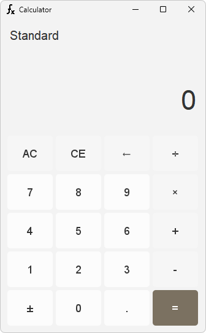

# 계산기 (with 자바프로그래밍기초2)

이 애플리케이션은 Java와 Java Swing을 사용하여 개발된 기본 계산기입니다.  
기본적인 사칙연산 기능을 제공합니다.

## 기능

### 1. 사칙연산
계산기는 네 가지 기본 사칙연산을 지원합니다:
- **덧셈 (+)**: 첫 번째 숫자와 두 번째 숫자를 더합니다.
- **뺄셈 (-)**: 첫 번째 숫자와 두 번째 숫자를 뺍니다.
- **곱셈 (×)**: 첫 번째 숫자와 두 번째 숫자를 곱합니다.
- **나눗셈 (÷)**: 첫 번째 숫자를 두 번째 숫자로 나눕니다. 0으로 나누는 경우 오류 메시지가 표시됩니다.

### 2. All Clear (AC)
**All Clear (AC)** 기능은 계산기의 모든 입력값과 연산 결과를 초기화 합니다.

### 3. Clear Entry (CE)
**Clear Entry (CE)** 기능은 현재 입력된 숫자를 지우며, 이전에 입력된 값이나 연산에는 영향을 미치지 않습니다.  
만약 계산 후에 사용하면 연산 과정과 결과를 초기화 합니다.

### 4. 숫자 부호 변환 (±)
**숫자 부호 변환 (±)** 버튼을 누르면 현재 입력된 숫자의 부호가 바뀝니다.  
양수일 경우 음수로, 음수일 경우 양수로 변경됩니다.

## 애플리케이션 구성

계산기는 다음과 같은 주요 구성 요소로 이루어져 있습니다:
- **메인**: UI를 호출하여 앱을 실행하는 메인 메서드가 작성되어 있습니다.
  - `Calculator`: 메인 프레임을 호출하여 앱을 실행합니다.
- **UI (사용자 인터페이스)**: Java Swing을 사용하여 GUI를 구성하며, 계산기 버튼, 결과를 보여주는 패널로 구성되어 있습니다.
  - `CalculatorFrame.java`: 애플리케이션의 메인 프레임을 설정합니다.
  - `CalculatorPanel.java`: 버튼과 디스플레이 패널의 레이아웃을 포함한 전체 구성 요소들을 담당합니다.

- **로직**: 버튼 입력을 처리하고 실제 계산을 수행하는 백엔드 로직입니다.
  - `ButtonEventHandler.java`: 이벤트가 발생하면 조건에 따라 올바른 'check 메서드'를 실행하도록 조건 처리를 수행합니다.
  - `ButtonEventCheck.java`
    - 각 조건에 따라 이벤트에 대한 이벤트 처리를 수행합니다.
    - 만약 계산이 필요하다면 'calculate 메서드'를 실행하도록 조건 처리를 수행합니다. 
  - `Calculate.java`: 연산자 버튼 이벤트가 발생하면 각 연산 이벤트 조건에 따라 계산을 수행합니다.

- **유틸리티**: 애플리케이션 전반에서 사용하는 상수 및 유틸리티 함수들을 저장합니다.
  - `Constants.java`: 타이틀, 메시지, 레이블, 색상의 정적 값을 관리합니다.
  - `RoundedButton`: `JButton`을 상속받아 곡선 버튼을 만들어줍니다.

- **리소스**: 애플리케이션 전반에서 사용하는 리소스 파일들을 저장합니다.
  - `icon.png`: 애플리케이션 앱의 아이콘 파일.

## 업데이트 예정
- 연산자가 한 번 사용된 후 연산자를 사용하면 연속으로 계산이 되도록 기능 추가
- 계산 결과 표시 후 숫자 입력 시 값이 초기화 되며 다음 계산 진행 기능 추가
- 계산 기록 기능 추가
